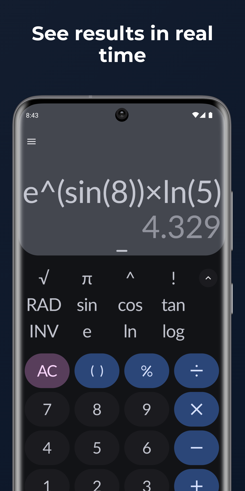
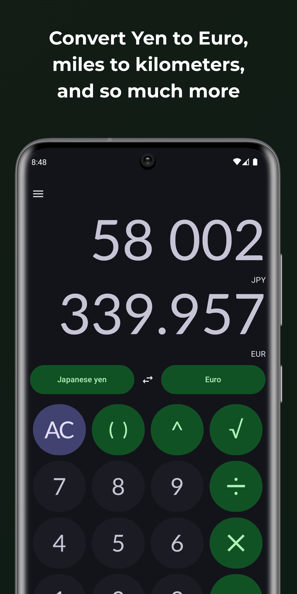
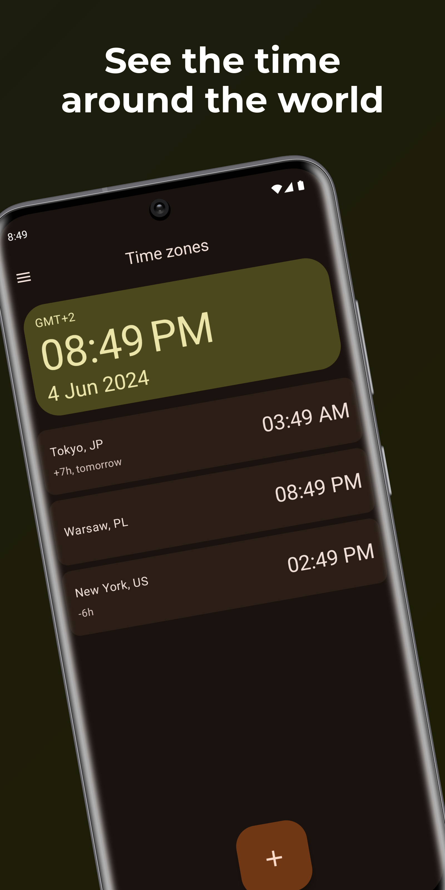
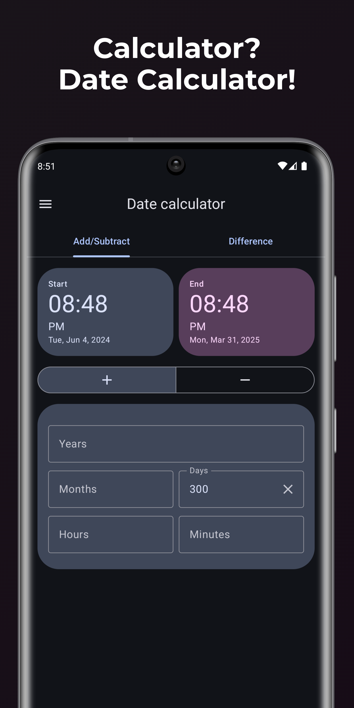
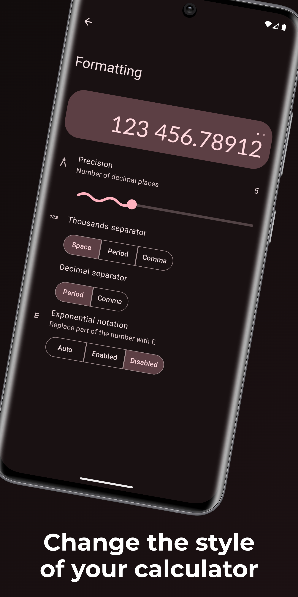

# NumberHub
➗ Your Hub for ✖️ Math / 💲 Currency rates / 📆 Date calculations / ⌚ Time zones

> [!NOTE]  
> This app was originally created by [sadellie](https://github.com/sadellie).
    Unfortunately, it has been archived on March 1st, 2024 (https://github.com/sadellie/unitto) without any notice or explanation. Since there has been no activity from sadellie on GitHub since then, I guess they are not actively working on projects anymore. I will maintain this app, but I do not plan to add new features. I don't have enough time to do that, but you are welcome to contribute. I will review and merge your pull requests.

    
    
    
    
    

# Download NumberHub

# Support NumberHub

You can support NumberHub in various ways:

## Contribute to the project

Add a new feature or fix bugs.

## Add translations

To add a translation, update the strings in `core/base/src/main/res/LANG/strings.xml` and open a PR

## Donate

It might sound crazy, but if you would just donate 1$, it would totally mean to world to me, since
it's a really small amount and if everyone did that, I can totally focus on NumberHub
and my other open source projects. :)

You can donate via [GitHub Sponsors](https://github.com/sponsors/Myzel394)
or via [crypto currencies](https://github.com/Myzel394/contact-me?tab=readme-ov-file#donations).

## Help
For help with the app see [HELP](HELP.md)

For details about the permissions used in the app see [SECURITY](SECURITY.md)
